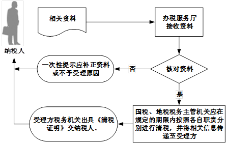

## 开具清税证明

###业务描述
     实行“三证合一、一照一码”登记的纳税人注销时，需先进行清税申报，向税务机关填报《清税申报表》，税务机关在结清应纳税款、多退（免）税款、滞纳金和罚款，缴销发票和其他税务证件后，向纳税人出具《清税证明》。
     除以上情形外，其他税务登记注销按照原有法律制度执行。

###报送资料
（1）《清税申报表》3份。

（2）单位纳税人应提供上级主管部门批复文件或董事会决议原件及复印件。

（3）非居民企业应提供项目完工证明、验收证明等相关文件原件及复印件。

（4）经办人身份证明。

###基本流程

  

###常见问题
