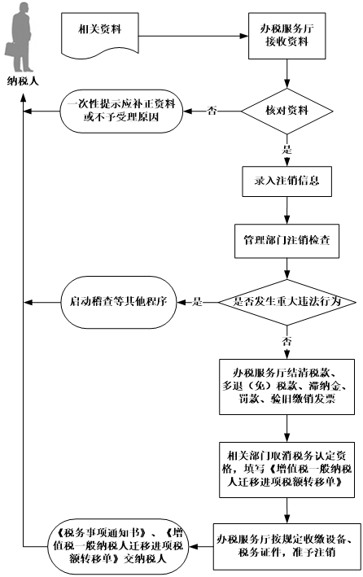

## 纳税人跨县（区）迁出  

###业务描述

    纳税人因住所、经营地变动涉及改变税务登记机关的，向原主管税务机关提出办理迁出。

###报送资料
（1）《注销税务登记申请审批表》。

（2） 税务登记证及副本。

（3）《发票领用簿》及未验旧、未使用发票。

（4） 住所、经营地点变动的相关证明资料原件及复印件。

（5） 使用增值税税控系统的增值税纳税人应提供金税盘、税控盘和报税盘，或者提供金税卡和IC卡。

（6） 其他按规定应收缴的设备。

###基本流程

 

###常见问题

