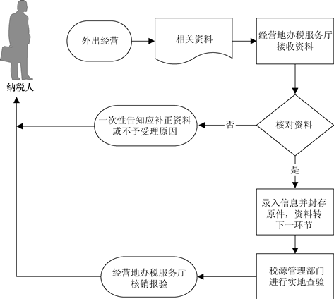

## 外出经营报验登记

###业务描述
     临时到外县（市）从事生产经营活动的纳税人，持所在地主管税务机关出具的《外出经营活动税收管理证明》向经营地税务机关办理报验登记，并接受经营地税务机关的管理。

###报送资料
（1）纳税人报验登记时提供：
——《外出经营活动税收管理证明》。
——税务登记证副本。
——建筑安装行业的纳税人还应提供外出经营合同原件及复印件。
（2）纳税人核销报验登记时提供：
——《外出经营活动情况申报表》（需在经营地缴纳税款的提供）。
——未验旧、未使用完的发票（领取发票的提供）。

###基本流程

  

###常见问题
