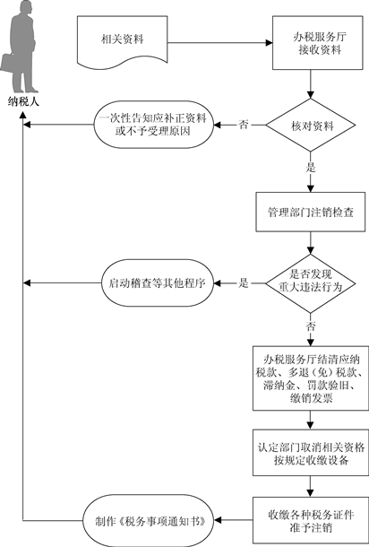

## 注销登记（单位及查账征收个体工商户）

###业务描述
     
  纳税人发生以下情形的，向主管税务机关申报办理注销税务登记：
    
    （1）因解散、破产、撤销等情形，依法终止纳税义务的。
    （2）按规定不需要在工商行政管理机关或者其他机关办理注销登记的，但经有关机关批准或者宣告终止的。
    （3）被工商行政管理机关吊销营业执照或者被其他机关予以撤销登记的。
    （4）因住所、经营地点变动，涉及改变税务登记机关的。
    （5）外国企业常驻代表机构驻在期届满、提前终止业务活动的。
    （6）境外企业在中华人民共和国境内承包建筑、安装、装配、勘探工程和提供劳务，项目完工、离开中国的。
    （7）非境内注册居民企业经国家税务总局确认终止居民身份的，应当自收到主管税务机关书面通知之日起15日内，向主管税务机关申报办理注销税务登记。

###报送资料

（1）《注销税务登记申请审批表》。

（2）税务登记证件和其他税务证件。

（3）《发票领用簿》及未验旧、未使用的发票。

（4）工商营业执照被吊销的应提交工商行政管理部门发出的吊销决定原件及复印件。

（5）单位纳税人应提供上级主管部门批复文件或董事会决议原件及复印件。

（6）非居民企业应提供项目完工证明、验收证明等相关文件原件及复印件。

（7）使用增值税税控系统的纳税人应提供金税盘、税控盘和报税盘，或者提供金税卡和IC卡。

（8）《中华人民共和国企业清算所得税申报表》及附表。

（9）其他按规定应收缴的设备。

###基本流程

  

###常见问题