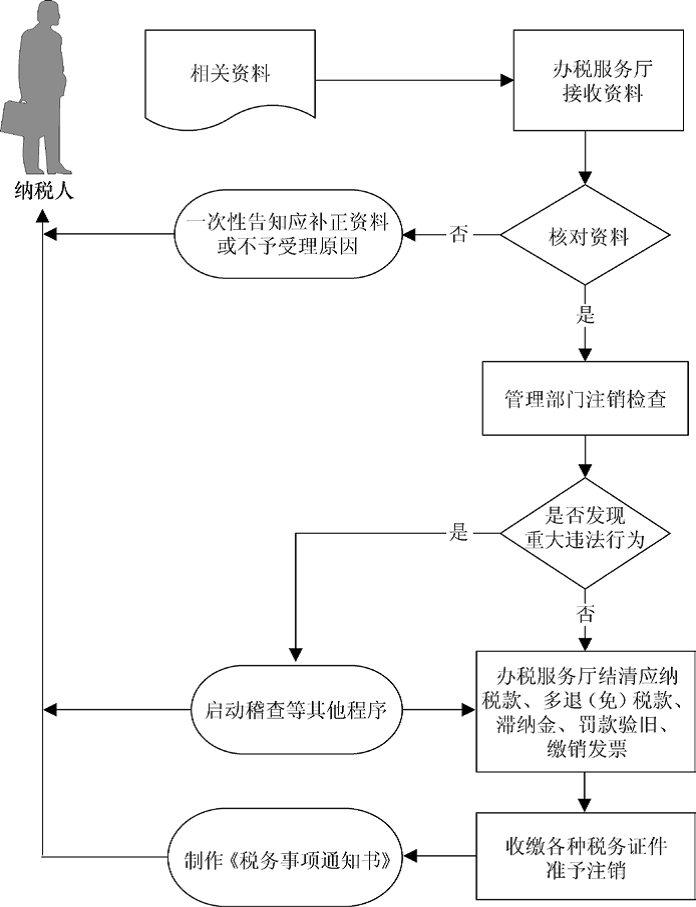

## 注销登记（定期定额个体工商户）

###业务描述
     
  纳税人发生以下情形的，向主管税务机关申报办理注销税务登记：
    
    （1）因发生破产、撤销以及其他情形，依法终止纳税义务的。
    （2）按规定不需要在工商行政管理机关或者其他机关办理注销登记的，但经有关机关批准或者宣告终止的。
    （3）被工商行政管理机关吊销营业执照或者被其他机关予以撤销登记的。
    （4）因住所、经营地点变动，涉及改变税务登记机关的。
    

###报送资料

（1）《注销税务登记申请审批表》。
（2）税务登记证及副本和其他税务证件。
（3）《发票领用簿》及未验旧、未使用的发票。
（4）工商营业执照被吊销的，应提交工商行政管理部门发出的吊销决定原件及复印件。
（5）使用增值税税控系统的增值税纳税人应提供金税盘、税控盘和报税盘，或者提供金税卡和IC卡。
（6）其他按规定应收缴的设备。

###基本流程

  

###常见问题
