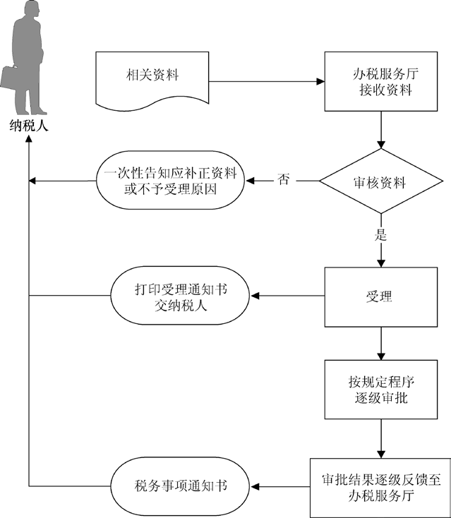

## 汇总缴纳消费税审批

###业务描述
     总机构和分支机构不在同一县（市）的，应当分别向各自所在地的主管税务机关申报纳税；经国务院财政、税务主管部门或者其授权的财政、税务机关批准，可以由总机构汇总向总机构所在地的主管税务机关申报纳税。

###报送资料
（1）纳税人申请报告。

（2）批准设立分支机构文件原件及复印件。

（3）分支机构或者集团子公司所在地工商部门证明原件及复印件。

###基本流程

  

###常见问题