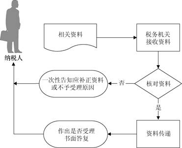

## 预约定价安排续签

###业务描述
     企业与税务机关达成的预约定价安排期满后自动失效，如需续签，应向税务机关提出申请。

###报送资料
（1）《预约定价安排续签申请书》2份。

（2）现行预约定价安排复印件。

（3）相关年度执行安排情况的报告。

（4）说明现行安排所述事实和相关环境未发生实质性变化的证明材料，以及所要求续签安排年度的相关预测情况等。

（5）说明一直遵守原预约定价安排中的各项条款和约定的相关材料。

###基本流程

  

###常见问题